# Dataverse Bridge to Digital Archive Repository (DAR)

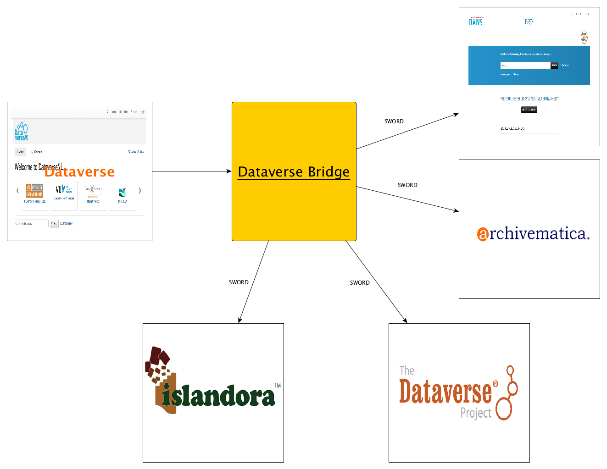

## Overview

The bridge service was developed in order to transfer datasets from a Dataverse instance to another Digital Archive Repository. At [DANS](https://dans.knaw.nl), we will use the bridge to transfer datasets from [DataverseNL](https://dataverse.nl) to our long-term archive called [EASY](https://easy.dans.knaw.nl/ui/home). The transfer is done by using the [SWORD](http://swordapp.org/) protocol (v2.0). 
[DANS](https://dans.knaw.nl) created a plug-in for [EASY](https://easy.dans.knaw.nl/ui/home), but it is possible to create other plug-ins for the bridge service in order to transfer datasets from Dataverse to a repository of your choice. 

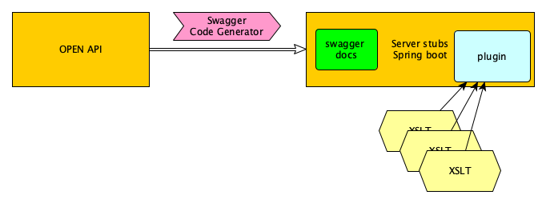

In the sections below more details are provided about:

-	[Architecture](#bridge-architecture)
-	[Changes needed in the Dataverse code](#dataverse-code)
-	[Setting up the bridge service](#bridge-service-setting)
-   [Containerize It](#bridge-service-docker)
-	[The EASY bridge plug-in](#bridge-plugin-easy)
-	[Creating your own plug-in](#creating-plugin)
-   [Dataverse-EASY Error Handling](#dataverse-easy-error-handling)


## <a name="bridge-architecture"></a>Architecture

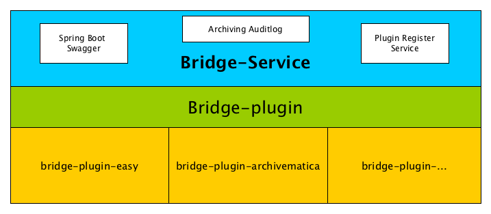

Due to modularity, flexibility and artifical separation purposes, the Dataverse Bridge application uses a simple plugin system architecture.
Thanks to the [Java reflection API](https://docs.oracle.com/javase/tutorial/reflect/) that allows [runtime type introspections](https://en.wikipedia.org/wiki/Type_introspection)
and [dynamic code loading](https://en.wikipedia.org/wiki/Dynamic_loading), the bridge-service will call a plugin (e.g. bridge-plugin-easy) without knowing all the details of the plugin in advance. \
More details on how to create a new plugin can be found [here](#creating-plugin).

The application consists of the following parts:
*  [bridge-plugin-lib](#bridge-plugin)
*  [bridge-service](#bridge-service)
*  [bridge-plugin-easy](#bridge-plugin-easy)

### <a name="bridge-plugin"></a>bridge-plugin
The _bridge-plugin-_ mainly consists of interfaces that are used by the bridge-service in order to identify and treat all plugins the same way. The plugins need to implement the interfaces.

### <a name="bridge-service"></a>bridge-service

The bridge-service of the Dataverse Bridge application is the host of application. The host application does not depend on the plugin implementation, it only relies on the plugin interface. 
To be able to load the plugin for the desired Digital Repository the bridge-service must know the class name of this plugin. 
The bridge-service will read the class name from the supplied [plugin configuration](#bridge-plugin-structure).
The bridge-service was generated by the [swagger-codegen](https://github.com/swagger-api/swagger-codegen) project.
It uses [OpenAPI-Spec](https://github.com/swagger-api/swagger-core) to generate the server stub.

The underlying library integrating swagger to SpringBoot is [springfox](https://github.com/springfox/springfox)


When Dataverse (or another system) send POST request as described in the Bridge API
```
{
  "darData": {
    "darName": "EASY",
    "darUsername": "uid"
    "darPassword": "pwd",
    "darUserAffiliation": "DANS"
   
  },
  "srcData": {
    "srcApiToken": "api-token!",
    "srcMetadataUrl": "http://ddvn.dans.knaw.nl/api/datasets/export?exporter=ddi&persistentId=hdl:101204/hkdsa.json",
    "srcMetadataVersion": "v1.1",
    "srcName": "dataverse"
  }
}
```

The following steps will be executed:

1. Bridge will check whether the given api_key (header) is the same as in the application.properties of Bridge, if doesn't match, response code 403 will be returned.
2. When skipDarAuthPreCheck (header) is true, Bridge will ask to the given destination DAR validate the given username and password/
3. Bridge will check the state of the current archiving process (based on srcMetadataUrl and srcMetadataVersion), 
if is not the case, Bridge will process the archiving based on the given darName.

## <a name="dataverse-code"></a>Changes needed in the Dataverse code
To enable "Archive" button on the dataverse side, additional _xhtml_, _java_ files and settings configurations are needed.

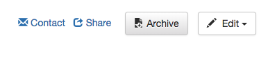

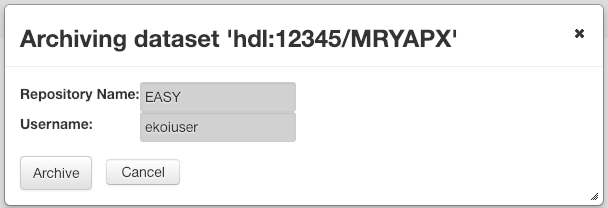


__Database Settings__

* _:DataverseBridgeConf_

Create a json (e.g. dvn.json) file that contains the bridge url and the alias of the user group that has permission to transfer datasets to another repository.
```
{
    "source-name": "dataverse",
    "metadata-url": "http://ddvn.dans.knaw.nl/api/datasets/export?exporter=ddi&persistentId=",
    "bridge": {
        "url": "http://10.0.2.2:8592/api/v1",
        "api-key": "API_KEY"
    },
    "dar": [{
        "dar-name": "EASY",
        "users": [
            {
                "group-name": "SWORD",
                "dar-user-name": "user-a",
                "dar-user-password": "user-a-pwd"
            },
            {
                "group-name": "SWORD-Tilburg",
                "dar-user-name": "user-b",
                "dar-user-password": "user-b-pwd"
            }
        ]
    }]
}
```


```
curl -X PUT -d '/path-to/dvn.json' http://localhost:8080/api/admin/settings/:DataverseBridgeConf
```
__Dataverse Role Setting__

To be able to archive a dataset with the Dataverse Bridge, the following conditions have been set:

* The user should be part of a group named 'SWORD' and has to the same name as _group-name_ that defines in the _:DataverseBridgeConf_.
* The user should have an __admin-role__ for the dataverse that contains the dataset that is going to be archived.

_Configuration_

Create a group 'SWORD' (alias 'SWORD') in the dataverse root. Add the users that should have permission to transfer a dataset to this group.\
It is not necessary to give this group permissions (a role) on any dataverse or dataset level. It is also not necessary to create a new role for this group.

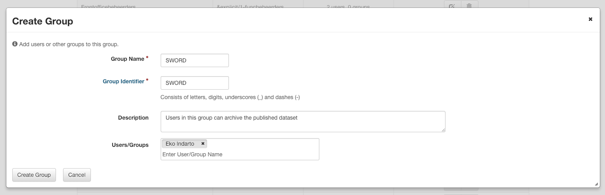


## <a name="bridge-service-setting"></a>Setting up the bridge service
There are two ways to set up the bridge service. You can use the [Quick start](#bridge-service-quickstart) option, or do it [step by step](#bridge-service-fullstart).

###### <a name="bridge-service-quickstart"></a>Quick start
Download [bridge-quickstart](bridge-service.zip), unzip it in a folder.\
To start run on the terminal _start.sh_.\
To shutdown, execute _shutdown.sh_ command.

This [Quick start](#bridge-service-quickstart) shows how to deploy the dataverse bridge by using the default properties.

###### [Step by step](#bridge-service-fullstart)
With this method you can generate the service step by step. This allows you to configure the service as you like (e.g. modificate the path, DAR target, port). 

###### <a name="bridge-service-fullstart"></a>How to generate:
The dataverse bridge includes the Spring boot that provides a set of starter Pom’s build file, which includes an embedded Servlet Container.\
The following command, shows how to go from an OpenAPI spec ([dataverse-bridge-api](dataverse-bridge-api.yaml)) to generated Spring Boot server stub.

```
swagger-codegen generate -i dataverse-bridge-api.yaml -l spring -o . -c dataverse-bridge-config.json\
 --import-mappings Archiving=nl.knaw.dans.bridge.service.db.domain.ArchivingAuditLog

```
Every time you run the code generation tool, it will overwrite the code it has generated previously. However, the generator tool offers a way of leaving certain files intact that is called .swagger-codegen-ignore file, which works just like a .gitignore file.

__.swagger-codegen-ignore__

```
README.md
pom.xml
src/main/java/nl/knaw/dans/dataverse/bridge/service/*
src/main/resources/application.properties

```

#### Start the Bridge Appication

__Prerequisites__:

* _Java 8_\
The Dataverse Bridge application is built for java 8 and up.
* _application properties_:\
The Dataverse Bridge application loads properties from the application properties that are located in config directory of the current working directory.\
The following properties are needed to fill in the application-dev.properties file:

```
################### Database Configuration ##########################
spring.datasource.url=jdbc:hsqldb:file:./database/bridgedb;sql.syntax_pgs=true
spring.datasource.username=sa
spring.datasource.password=
````
'./database/bridgedb' means that the in-memory hsql database will be created in the database directory of the current working directory.

````
################### JavaMail Configuration ##########################
bridge.apps.support.email.from=
bridge.apps.support.email.send.to=
spring.mail.host=


################# Apps Configuration ##############################
bridge.apikey=
bridge.temp.dir.bags=/path/bagit-temp/bags
````
To launch the service in another environment, you can use the profile-specific properties that are usually specified. E.g. application-act.properties for acceptation server or application-prod.properties for a production server. \
You can launch your application with a _-D_ argument, such as _-Dspring.profiles.active=prod_ to launch the Dataverse Bridge application using application-prod.properties.

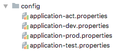


* _Log Directory_

The location of the log directory is configured in the application properties. As default, the log directory is located in the 'logs' directory of the current working directory.
```
################### Logging Configuration ##########################
logging.path=./logs
````

* _Plugins Directory_

In this directory, you can put your plugin. The plugin itself needs to have a certain structure that is described [here](#bridge-plugin-structure).

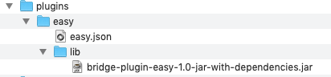


##### Starting the application

Starting the service as an simple java application.\
The 'application-dev.properties' is used as indicate on '-D' argument: -Dspring.profiles.active=dev

```
java -Dspring.profiles.active=dev -jar target/bridge-service-0.5.0.jar

```
To start in the debug mode:
```

java -Dspring.profiles.active=dev -Xdebug -Xrunjdwp:transport=dt_socket,server=y,suspend=n,address=5105 -jar bridge-service-0.5.0.jar

```

You can view the api documentation in swagger-ui by pointing to
_http://localhost:8592/api_

##### Stopping the application

To shutdown the dataverse bridge application:
````
curl -X POST 'http://localhost:9285/api/admin/shutdown
````

## <a name="bridge-service-docker"></a>Dockerize Bridge Service
Bridge Service has a simple ["Dockerfile"](https://docs.docker.com/reference/builder/) file format that it uses to specify the "layers" of the Bridge Service image. 
Although this Dockerfile is very simple, but that’s all you need to run the Bridge Service with no garnish: just Java and a JAR file.
 
 ````
FROM openjdk:8-jdk-alpine
VOLUME /tmp
ARG APP_BASE_DIR=/usr/local/bridge
ARG APP_PROP
ARG APP_LIB
ARG JAR_FILE
RUN mkdir -p ${APP_BASE_DIR}/bin && cd ${APP_BASE_DIR} && mkdir config bin/lib
COPY ${JAR_FILE} ${APP_BASE_DIR}/bin/bridge-service.jar
COPY ${APP_LIB} ${APP_BASE_DIR}/bin/lib
COPY ${APP_PROP} ${APP_BASE_DIR}/config

ENTRYPOINT [ "sh", "-c", "cd /usr/local/bridge; java -Dspring.profiles.active=docker -Djava.security.egd=file:/dev/./urandom -jar ./bin/bridge-service.jar" ]
 ````
 To bulid the Docker image, the following command line needs to execute:
 ````
 ./mvnw install dockerfile:build
 ````  
 Then you can run it like this:
 ````
   docker run -p 8592:8592 -t bridge/service 
  ````  
  The application is then available on [http://localhost:8592/api/v1](http://localhost:8592/api/v1)

  
## <a name="creating-plugin"></a>Creating a plugin

The plugin relies on the power of a XSLT that has the ability to change the structure of a XML file  from one format to another. In this case, it will transform the dataverse XML metadata (DDI, Dublin Core) or even Dataverse Metadata in JSON format to the desired Digital Archive Repository metadata format.
Plugins must implements the [IAction](https://github.com/ekoi/bridge-plugin/blob/master/src/main/java/nl/knaw/dans/dataverse/bridge/plugin/common/IAction.java) interface of the [bridge-plugin](https://github.com/ekoi/bridge-plugin). 

Include this dependency into your pom.xml to obtain the 0.5-SNAPSHOT release version of the bridge-plugin
````
<dependency>
    <groupId>nl.knaw.dans.bridge.plugin.lib</groupId>
    <artifactId>bridge-plugin</artifactId>
    <version>1.0</version>    
 </dependency>
````

After creating the jar file from the project, the plugin can be uploaded (or deploy in the plugins directory of bridge-service) to the brige-service in the zip format.
The plugin must have the following <a name="bridge-plugin-structure"></a>__Plugin Directory Structure__:

```
easy (directory, must be in lowercase)
easy.json (json file that describe the plugin, see an example below)
-- lib (directory where the plugin.jar is located)
```
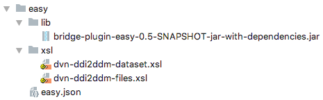


An example of *easy.json* that is used for achiving from Dataverse and B2Share to EASY
```
{
  "dar-name": "EASY",
  "dar-iri":"http://deasy.dans.knaw.nl/sword2/collection/1",
  "action-class-name": "nl.knaw.dans.bridge.plugin.dar.easy.EasyIngestAction",
  "action-class-url": "lib/bridge-plugin-easy-1.0-jar-with-dependencies.jar",
  "xsl": [{
    "source": "dataverse",
    "transformer": [
      {
        "xsl-name": "dataset.xml",
        "xsl-url": "https://raw.githubusercontent.com/ekoi/dataverse-bridge-mappings/fixed-mappings/dist/static/xsl/easy/easy/dataverse/dataverseJson-to-easy-dataset.xsl"
      },
      {
        "xsl-name": "files.xml",
        "xsl-url": "https://raw.githubusercontent.com/ekoi/dataverse-bridge-mappings/fixed-mappings/dist/static/xsl/easy/easy/dataverse/dataverseJson-to-easy-files.xsl"
      },
      {
        "xsl-name": "source-files-location",
        "xsl-url": "https://raw.githubusercontent.com/ekoi/dataverse-bridge-mappings/fixed-mappings/dist/static/xsl/easy/easy/dataverse/dataverseJson-to-files-location.xsl"
      }
    ]
  },
    {
      "source": "b2share",
      "transformer": [
        {
          "xsl-name": "dataset.xml",
          "xsl-url": "http://localhost:8592/api/v1/xsl/easy/b2share/b2shareJson-to-easy-dataset.xsl"
        },
        {
          "xsl-name": "files.xml",
          "xsl-url": "http://localhost:8592/api/v1/xsl/easy/b2share/b2shareJson-to-easy-files.xsl"
        },
        {
          "xsl-name": "source-files-location",
          "xsl-url": "http://localhost:8592/api/v1/xsl/easy/b2share/b2shareJson-to-files-location.xsl"
        }
      ]
    }
  ]
}
```

## <a name="bridge-plugin-easy">The EASY bridge plug-in
The [bridge-plugin-easy](https://github.com/ekoi/bridge-plugin-easy) is the implementation of a bridge-plugin for ingesting data to the [EASY](https://easy.dans.knaw.nl/ui/home) archive. This plugin transforms the dataverse metadata file in DDI format into the required metadata files by EASY; ‘dataset.xml’ and ‘files.xml’. This is done according to the requirements described in this document: '[Depositing in EASY with SWORD v2.0](https://easy.dans.knaw.nl/doc/sword2.html)' requirements document.


## <a name="ataverse-easy-error-handling"></a>Dataverse-EASY Error Handling
In general, a FAILED indicates a problem on the EASY side, and a REJECTED is a problem on the client side (Bridge).
In the Dataverse, the error is writen in the darnote column of datasetversion table.

##### FAILED or ERROR
The darnote column of datasetversion table shows "ERROR"; as in the user interface shows below:
 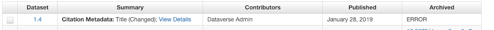
- Bridge Admin receive an email
- Email example:\
  *Subject: [throwable] on id: ​26*\
   Content:
```
<feed xmlns="​http://www.w3.org/2005/Atom">
    <id>https://act.easy.dans.knaw.nl/sword2/statement/cb 7c2638-58f9-435c-b72d-65c1955842a0</id>
    <link
        href="​https://act.easy.dans.knaw.nl/sword2/statement/cb7c2638-58f9-435c-b72d-65c1955842a 0​"
        rel="self"/>
    <title type="text">Deposit cb7c2638-58f9-435c-b72d-65c1955842a0</title>
    <author>
        <name>DANS-EASY</name>
    </author>
    <updated>2019-01-16T15:09:13.804Z</updated>
    <category term="FAILED" scheme="​http://purl.org/net/sword/terms/state​" label="State">Failed to
        ingest /var/opt/dans.knaw.nl/tmp/easy-fedora-dataset-staging/staged-dataset-4443055688733
        458494/Metadata export from DataverseNL_hdl-12345-​6DVUBL​_json:
        /var/opt/dans.knaw.nl/tmp/easy-fedora-dataset-staging/staged-dataset-4443055688733
        458494/Metadata export from DataverseNL_hdl-12345-6DVUBL_json/fo.xml :
        java.net.ConnectException: Connection refused (Connection refused)​</category>
    <entry>
        <content type="multipart/related" src="urn:uuid:cb7c2638-58f9-435c-b72d-65c1955842a0"/>
        <id>urn:uuid:cb7c2638-58f9-435c-b72d-65c1955842a0</id>
        <title type="text">Resource urn:uuid:cb7c2638-58f9-435c-b72d-65c1955842a0</title>
        <summary type="text">Resource Part</summary>
        <updated>2019-01-16T15:09:18.264Z</updated>
    </entry>
</feed>

```
Action, in the following sequences:
-  Inform EASY application manager
-  Delete the record (in this case no 16, see email subject) from auditlog by using thefollowing command on the terminal:
```
 curl -X GET --header 'Accept: application/json' 'http://localhost:8592/api/v1/auditlog/16'
```                 
   Result:
```
"srcMetadataUrl":"https://test.dataverse.nl/api/datasets/export?exporter=dataverse_json&persistentId=hdl:12345/6DVUBL",  "srcAppName": null,  "srcMetadataVersion": "1.7",  "destinationIri": "https://act.easy.dans.knaw.nl/sword2/collection/1",
```
   Delete record from auditlog:
````
curl -X DELETE --header 'Accept: application/json' --header 'api_key: the api-key(see application.properties)' 'http://localhost:8592/api/v1/auditlog/16'
````
- Reset the record of datasetversion (darnote column) that belongs to rejected dataset(see email message above:  6DVUBL) by using the following SQL Query:
````
select dv.id, dv.darnote, d.identifier 
from datasetversion dv, dataset d 
where dv.dataset_id=d.id and dv.versionnumber=1​ ​ and dv.minorversionnumber=​7​ and d.identifier='​6DVUBL'

````
*Note*: the *dv.versionnumber* and *dv.minorversionnumber* values come from "srcMetadataVersion": ​"​1.7​" 

The result of the query should retrieve "**ERROR**" as the value of darnote.

Update Query:
````
Update datasetversion set darnote = null
where id in 
    (select dv.id 
     from datasetversion dv, dataset d 
     where dv.dataset_id=d.id and dv.darnote='​ERROR'​ and dv.versionnumber=​1 and dv.minorversionnumber=7​ a​ nd d.identifier=​'6DVUBL')
````
##### REJECTED
The darnote column of datasetversion table shows "REJECTED"; as in the user interface shows below:
 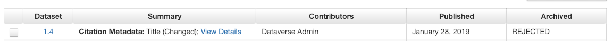
 
- Bridge Admin receive an email     
- Email example:\                   
  *Subject: [throwable] on id: ​18*\
````
<feed xmlns="http://www.w3.org/2005/Atom‌">
    <id>‌https://act.easy.dans.knaw.nl/sword2/statement/3dff22f1-699b-467e-8409-355a161c759a‌</id>
    <link href="https://act.easy.dans.knaw.nl/sword2/statement/3dff22f1-699b-467e-8409-355a161c759a"
        rel="self"/>
    <title type="text">Deposit 3dff22f1-699b-467e-8409-355a161c759a</title>
    <author>
        <name>DANS-EASY</name>
    </author>
    <updated>2019-01-16T08:26:31.317Z</updated>
    <category term="REJECTED" scheme="http://purl.org/net/sword/terms/state" label="State">Rejected
        3dff22f1-699b-467e-8409-355a161c759a: Bag was not valid according to Profile Version 0.
        Violations: - [3.1.1] metadata/dataset.xml does not conform to DANS dataset metadata schema:
        1 exception occurred: org.xml.sax.SAXParseException; lineNumber: 28; columnNumber: 35;
        cvc-complex-type.2.4.a: Invalid content was found starting with element
        'dcterms:accessibleToRights'. One of '{"http://easy.dans.knaw.nl/schemas/md/ddm/‌":audience,
        "http://easy.dans.knaw.nl/schemas/md/ddm/‌":accessRights}' is expected. </category>
    <entry>
        <content type="multipart/related" src="urn:uuid:3dff22f1-699b-467e-8409-355a161c759a"/>
        <id>urn:uuid:3dff22f1-699b-467e-8409-355a161c759a</id>
        <title type="text">Resource urn:uuid:3dff22f1-699b-467e-8409-355a161c759a</title>
        <summary type="text">Resource Part</summary>
        <updated>2019-01-16T08:26:33.679Z</updated>
    </entry>
</feed>

````
*Remark*: Shouldn't happen on production since it is a mapping problem.

Action: 
- See the following line in the email content:
````
metadata/dataset.xml does not conform to DANS dataset metadata schema: 1 exception occurred: org.xml.sax.SAXParseException; lineNumber: 28; columnNumber: 35; cvc-complex-type.2.4.a: Invalid content was found starting with element 'dcterms:accessibleToRights'.
````
- Check the bridge-service.log file
- Evaluate and fix the dataverseJson-to-easy-dataset.xslt file.
- After xslt is fixed, delete the auditlog record of the failed dataset:
````
curl -X GET --header 'Accept: application/json' 'http://localhost:8592/api/v1/auditlog/18'
````
Result:
````
"srcMetadataUrl": "https://test.dataverse.nl/api/datasets/export?exporter=dataverse_json&persistentId=hdl:12345/XO55Z6",
"srcAppName": null,
"srcMetadataVersion": "1.4",
"destinationIri": "https://act.easy.dans.knaw.nl/sword2/collection/1",
````
Delete record (example: number 18) from auditlog:
````
curl -X DELETE --header 'Accept: application/json' --header 'api_key: the api-key (see application.properties)' 'http://localhost:8592/api/v1/auditlog/18'
````
- Reset the record of datasetversion (darnote column) that belongs to failed dataset (see curl GET result above: XO55Z6‌*) *‌by using the following SQL queries: 
````
select dv.id, dv.darnote, d.identifier from datasetversion dv, dataset d where dv.dataset_id=d.id and dv.darnote='FAILED' and dv.versionnumber=1 and dv.minorversionnumber=4 and d.identifier='‌XO55Z6';

Update datasetversion set darnote ='' where id in (select dv.id from datasetversion dv, dataset d where dv.dataset_id=d.id and dv.darnote='FAILED' and dv.versionnumber=1 and dv.minorversionnumber=4 and d.identifier='‌XO55Z6');
````
##### OTHER or ERROR
As in the case of "REJECTED", in the darnote column of datasetversion table shows "ERROR" as in the user interface shows below:
 
 
- Bridge Admin receive an email     
- Email example:                   
  *Subject: [throwable] on id: 1945*\
  *Content*:
````
[nl.knaw.dans.bridge.plugin.dar.easy.EasyIngestAction] Status = HTTP/1.1 403 Forbidden. Response body follows:<html>
<head>
<meta http-equiv="Content-Type" content="text/html;charset=ISO-8859-1"/>
<title>Error 403 Forbidden</title>
</head>
<body>
<h2>HTTP ERROR: 403</h2>
<p>Problem accessing /collection/1. Reason:
<pre>    Forbidden</pre></p>
<hr /><i><small>Powered by Jetty:// 8.2.0.v20160908</small></i>
</body>
</html>

````
Action:
- Check the bridge-service.log file
- Analyse the errors.
- Check the record of datasetversion of dataset bu using the following sql command:
````
select dv.id, dv.darnote, d.identifier 
from datasetversion dv, dataset d 
where dv.dataset_id=d.id and dv.versionnumber=(see the log file) and dv.minorversionnumber=(see the logfile) and d.identifier='(see the logfile)'
````
